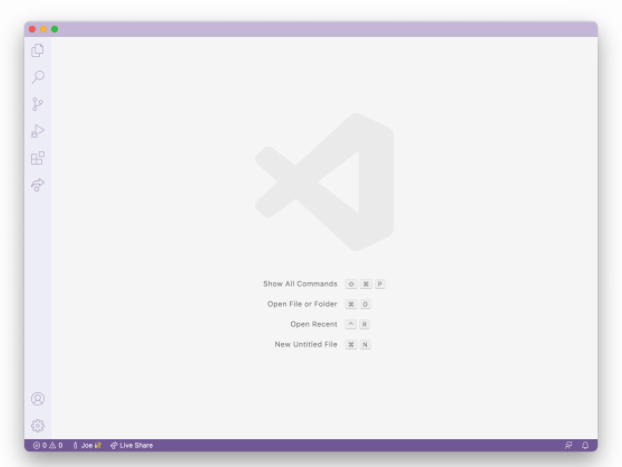
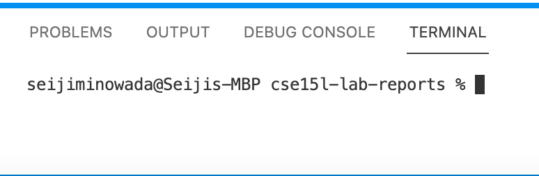
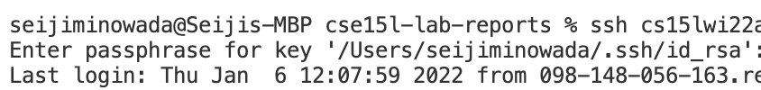
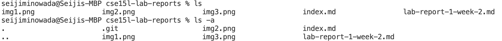
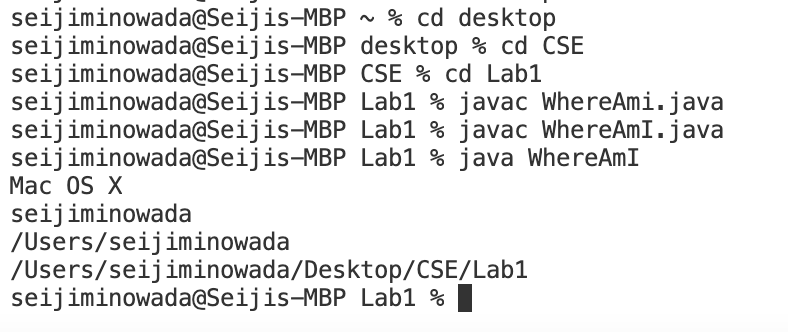
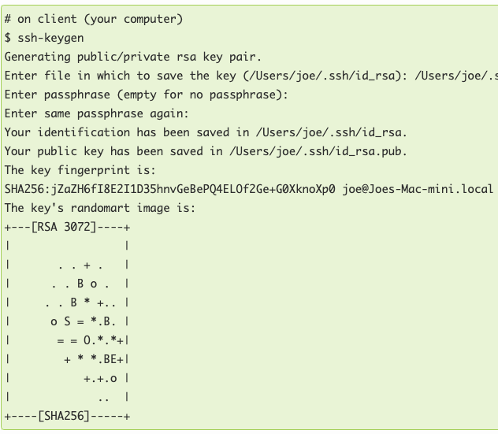
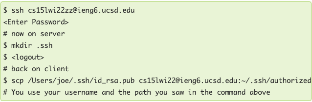
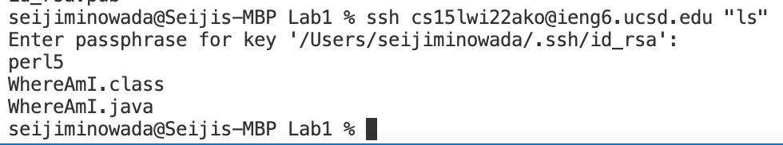
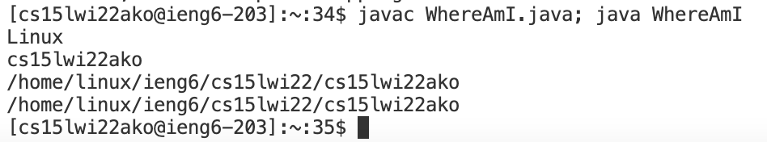

**Step 1: Installing VSCode**
* Go to VSCode  [website](https://code.visualstudio.com/)
* Download for your operating system
* When installed your screen should look like below


**Step 2: Remotely Connecting**
* Next you want to open up a new terminal
* It can be found at the bottom of the page by dragging up
* It should look something like this 


* The command we are going to use to connect is *ssh*
* If you know your student account you can type in the terminal `ssh cs15lwi22xx@ieng6.uced.edu` where xx is your personal account combination
* If not you can find it here: https://sdacs.ucsd.edu/~icc/index.php
* It will then prompt you for a password: *As you enter your password nothing will pop up. This is on purpose*


**Step 3: Trying Some Commands**
* Try running some commands such as 
    * cd (Changes directory)
    * ls (Lists files/directories)
    * ls -a (Lists files that start with "." as well)


**Step 4: Moving Files with `scp`**
* To copy files from computer to a server we use the command `scp`
* This command will be ran from your client
* Create a java file called `WhereAmI.java`
* Copy and paste this code in 
```
class WhereAmI {
  public static void main(String[] args) {
    System.out.println(System.getProperty("os.name"));
    System.out.println(System.getProperty("user.name"));
    System.out.println(System.getProperty("user.home"));
    System.out.println(System.getProperty("user.dir"));
  }
}
```
* Running it with javac and java you can see what it does. Make sure you are in the right directoy when running it
* In my case, I have `WhereAmI.java` in the folder Lab1



* In the same terminal as before run this command
` scp WhereAmI.java cs15lwi22xx@ieng6.ucsd.edu:~/ `
* Make sure to replace xx with your own 
* You should see the file name pop up in terminal


* To confirm the file has been copied you can login and run javac and java using *Step 2*

**Step 5: Setting an SSH Key**
* A ssh key will replace the need for a password by using a public and private key
* The command we will be using is `ssh-keygen`
* When prompted where to save type /Users/xx/.ssh/id_rsa but replace xx with your client name
* It should look something like this



* Next we need to copy the public key onto the server
* ssh in and make a new directory with `mkdir`
* After you can logout and scp the ssh key to your server
* Now you dont have to enter your password everytime
* It should look something like this



**Step 6: Optimizing Remote Running**
* When using the ssh command, you can put quotes around a command and it will automatically run and logout



* You can also use semicolons to run multiple commands



* Using this new method we can reduce the number of keystrokes
* With the method I was able to scp a file and run it with only 6 keystrokes.
1. Use up arrow to get command ` scp WhereAmI.java cs15lwi22xx@ieng6.ucsd.edu:~/ `
2. hit enter
3. Use up arrow twice to get `ssh cs15lwi22xx@ieng6.uced.edu javac WhereAmI.java; java WhereAmI`
4. hit enter again and you will ssh and run WhereAmI.java