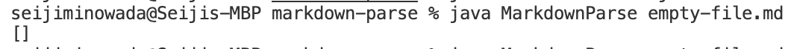
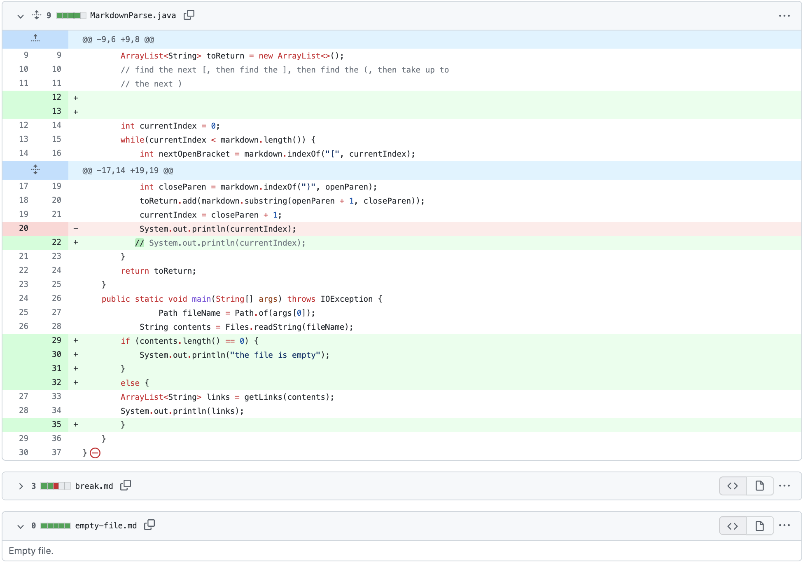
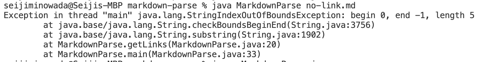
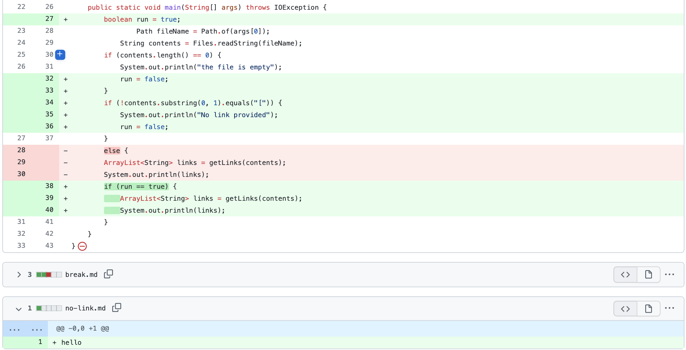
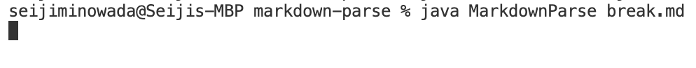
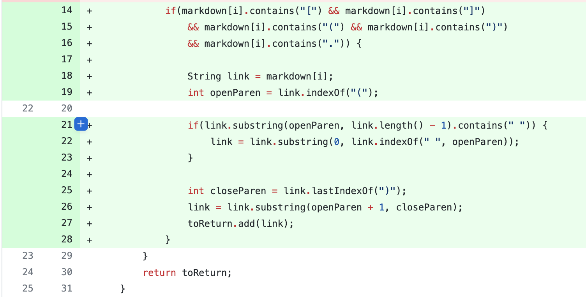

**Change 1**

[Failure Inducing File](https://github.com/sminowada/markdown-parse/blob/main/empty-file.md)

My first error was when trying to run markdownparse on an empty file. The bug was I had no handling for an empty file. The symptom was the terminal simply printed `[]`. Once I updated the file it prints `the file is empty` to console to let the user know their file is empty and it is pointless to run our program on their file. 

**Change 2**

[Failure Inducing File](https://github.com/sminowada/markdown-parse/blob/main/no-link.md)

My error was trying to run markdownparse with no link in the file. The bug was there was no handling for a file being read with text but no link. The sympton was the terminal threw an index out of bounds error. I updated it so that the console would print `no link found`.

**Change 2**

[Failure Inducing File](https://github.com/sminowada/markdown-parse/blob/main/break.md)

My error was trying to run markdownparse when there was a parentheses in the link. The bug was the code thought the first close parentheses was the end of the link. The sympton was an infinite while loop. I updated it so that the console would handle the issue.

