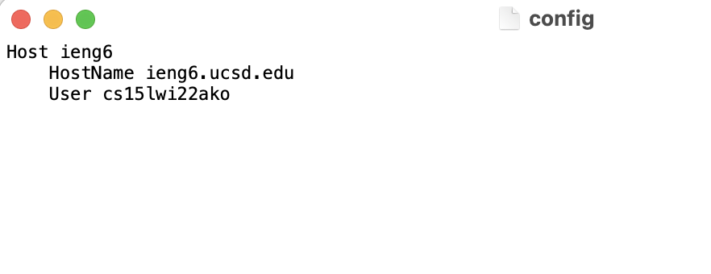
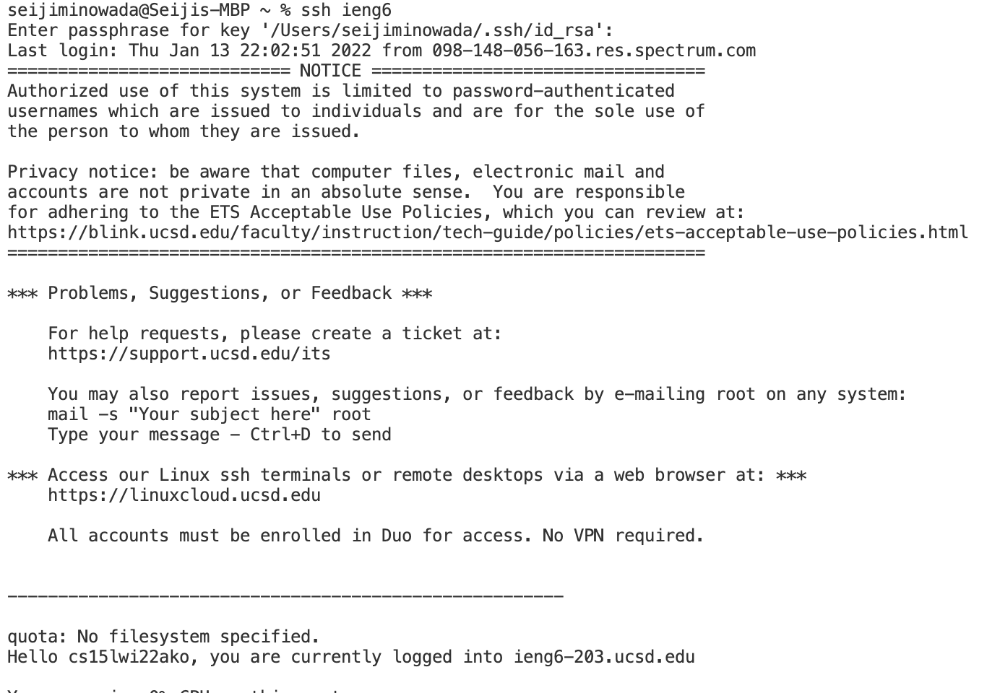
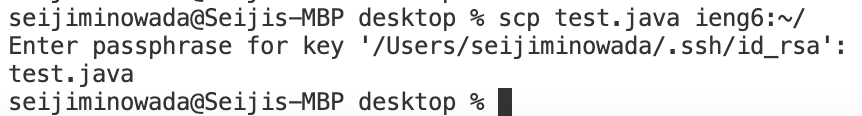

# Streamling SSH Configuration

**Step 1: Config File**
* In your config file, you want to type this code 
``` 
Host ieng6
    HostName ieng6.ucsd.edu
    User cs15lwi22zzz (use your username)
```
* In the first line you can change ieng6 to anything you want, this will be the alias. 


* Your config file should look similar to this. For my config file, I used TextEdit to edit my file, and ieng6 as my alias

**Step 2: SSH**
* Next you want to type `ssh ieng6` in the terminal. If you changed your alias name, replace ieng6 with it



* Your screen should look like this to show that you have successfully logged into your server

**Step 3: SCP With Alias**
* We can also SCP and copy files to our remote server using the config file

* The command is `scp test.java ieng6:~/`
* Replace test.java with the file you want to copy over and ieng6 with your alias if you used a different one


* After if successfully copies it, your terminal should look like this
