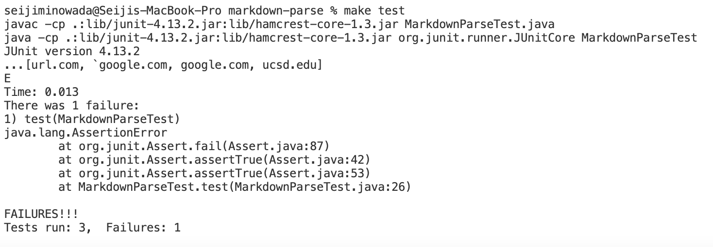

[My Markdownparse](https://github.com/sminowada/markdown-parse)

[MDParse I reviewed](https://github.com/samw0627/markdownparse2)

**Snippet 1: Own implementation**

Expected Output: 
[`google.com, google.com, ucsd.edu]

Test in code :

Junit output:

Code change: 
A code change that we could do to fix the bug is to look for index of backticks. Then, if a bracket is in between the backticks we disregard it and treat is as any regular character. 

**Snippet 2: Own implementation**

Expected Output: 
[a.com, example.com]

Test in code :

Junit output:

Code change: 
I think this code change would be a little harder. We would have to implement some code that would check if the brackets have a match and if they do, use only the outer ones until they hit a set of parentheses, and if not disregard. 

**Snippet 3: Own implementation**

Expected Output: 
[a.com, example.com]

Test in code :

Junit output:

Code change: 
I think this code change is harder. Since we are using an arrayList right now we would probably have to change it. We have to account for spaces and new lines in our code which we don't really take into account for currently.

**Snippet 1:  Reviewed implementation**

Expected Output: 
[`google.com, google.com, ucsd.edu]

Test in code :

Junit output:

Code change: 
Currently I am getting an infinite loop because currentIndex never gets incremented 

**Snippet 2: Reviewed implementation**

Expected Output: 
[a.com, example.com]

Test in code :

Junit output:

Code change: 
Currently I am getting an infinite loop because currentIndex never gets incremented 

**Snippet 3: Reviewed implementation**

Expected Output: 
[a.com, example.com]

Test in code :

Junit output:

Code change: 
Currently I am getting an infinite loop because currentIndex never gets incremented 

