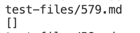

**Finding Tests With Different Results**

When I was looking for tests with different results I looked through manually. It really helped that I had the test numbers so I could easily compare the two tests. 

**Two Of My Tests** 

**Corresponding Tests**

For test 579, I think that my implementation is correct because the exclamation point before the open brackets indicates that it is an image and should therefore not print out what is in the parentheses. I think the bug in the code is that there is never any handling for an image. Therefore, it fails to recognize that it is an image and treats it as a link.

For test 500, I think that my code has the bug and is not displaying the correct output. The other implementation displays the correct output. I think it is because my code searched for a `.` to make sure that it is a link. However, in this case it seems it does not need a `.` I have included the section that contains it below. 

